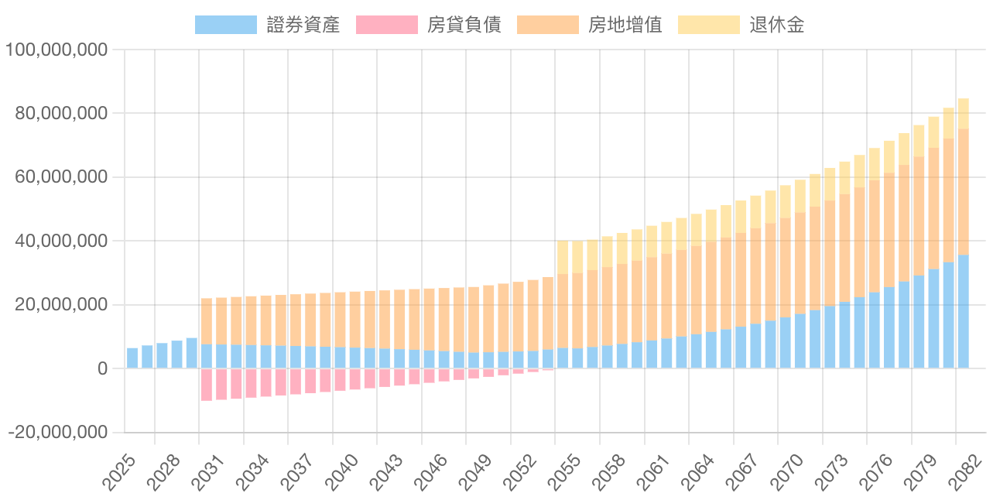

# EN Chu 的Javascript領域

## 開源財務規劃表

1. 金融惠普：民眾可以快速建立生涯財務觀念，並提共<a href="https://econ-sense.com/calendar.html#%E8%81%AF%E7%B5%A1en">回饋意見</a>。
2. 開源驗證：任何人都可以檢視程式碼是否有安全漏洞。 (<a href="https://github.com/Chuiantw1212/econ-sense-vitepress" target="_blank">前端開源</a> + <a href="https://github.com/Chuiantw1212/econ-sense-ap-fastify-typescript" target="_blank">後端開源</a>)。
3. 資料安全：提供了表單離線匯出功能，不需註冊也可以保留試算結果。

## 技術

### 前端

### 後端

## 雲服務與其他

## Git歷史紀錄

